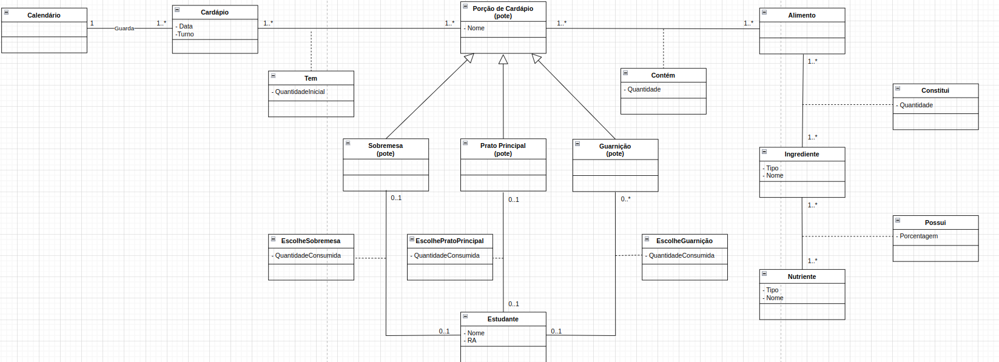

# Equipe DBDCP (Dinossauros, Bancos de Dados e Coisas Parecidas)
## Subgrupo DBDCP
* Márcio Levi Sales Prado - 183680
* Francisco Vinicius Sousa Guedes - 260440
* Davi Santos

### Modelo Conceitual ER

### Modelo Conceitual UML

