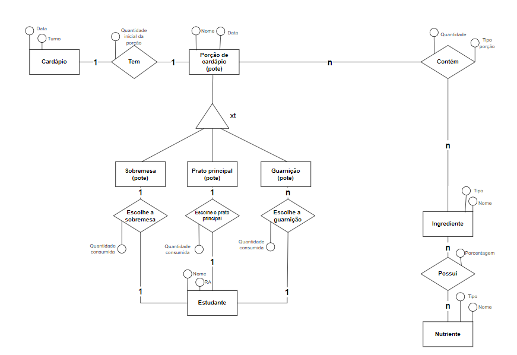

# Equipe Dinossauros, Bancos de Dados e Coisas Parecida (DBDCP)
## Membros
* Márcio Levi Sales Prado - 183680
* Francisco Vinicius Sousa Guedes - 260440
* Davi Gabriel Bandeira Coutinho - 183710

### Modelo conceitual ER revisado

*Diagrama ER revisado*
### Mapeamento para o modelo relacional
NUTRIENTE(<u>nome</u>, tipo)
POSSUI(<u>nome_ingrediente, nome_nutriente</u>, porcentagem)
    nome_ingrediente chave estrangeira -> INGREDIENTE(nome)  
    nome_nutriente chave estrangeira -> NUTRIENTE(nome) 
INGREDIENTE(<u>nome</u>, tipo) 
CONTÉM(<u>nome_ingrediente, nome_porcao</u>, quantidade, tipo_porcao) 
    nome_ingrediente chave estrangeira -> INGREDIENTE(nome)  
    nome_porcao chave estrangeira -> PORCAO_CARDAPIO(nome) 
SOBREMESA(<u>nome, data</u>) 
ESCOLHE_SOBREMESA(nome_sobremesa, data, RA) 
    RA chave estrangeira -> ESTUDANTE(RA) 
    nome_sobremesa chave estrangeira -> SOBREMESA(nome) 
PRATO_PRINCIPAL(<u>nome, data</u>) 
ESCOLHE_PRATO_PRINCIPAL(nome_prato, data, RA) 
    RA chave estrangeira -> ESTUDANTE(RA) 
    nome_prato chave estrangeira -> PRATO_PRINCIPAL(nome) 
GUARNIÇÃO(<u>nome, data</u>) 
ESCOLHE_GUARNIÇÃO(nome_guarnição, data, RA) 
    RA chave estrangeira -> ESTUDANTE(RA) 
    nome_guarnição chave estrangeira -> GUARNIÇÃO(nome) 
ESTUDANTE(nome, <u>RA</u>) 
CARDÁPIO(<u>data, turno</u>, nome_prato_principal, nome_sobremesa, nome_guarnição)
    